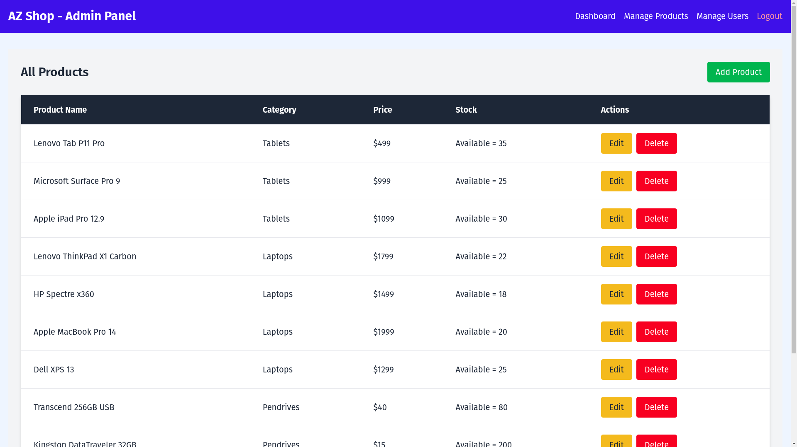

# AZ Shop - E-Commerce Platform

AZ Shop is a modern e-commerce platform built with the MERN stack, using Next.js for the frontend and Express.js for the backend. This project showcases a fully functional shopping experience with admin and user dashboards, product management, and cart functionality.
## Demo

Check out the live demo: [AZ Shop Demo](https://your-demo-link.com)

## Features

- **User Features**:
  - Browse products by categories.
  - View detailed product pages.
  - Add products to the cart.
  - User authentication (signup/login).
  - Responsive and user-friendly design.

- **Admin Features**:
  - Manage products (add, edit, delete).
  - View and manage users.
  - Access admin dashboard.

- **General Features**:
  - Server-side rendering for SEO optimization.
  - Modern design with Tailwind CSS.
  - Image upload functionality for products.

## Tech Stack

### Frontend
- **Framework**: Next.js (App Router)
- **Styling**: Tailwind CSS
- **State Management**: React Context API

### Backend
- **Framework**: Express.js
- **Database**: MongoDB
- **Authentication**: JSON Web Tokens (JWT)

## Folder Structure

### Backend (`/backend`)
```
backend/
├── controllers/    # Request handling logic
├── models/         # MongoDB schemas
├── routes/         # API endpoints
├── middleware/     # Authentication & other middleware
├── config/         # Database and environment setup
├── app.js          # Entry point of the backend
```

### Frontend (`/src`)
```
src/
├── app/            # Next.js app directory
│   ├── admin/      # Admin-specific pages
│   ├── cart/       # Shopping cart page
│   ├── products/   # Product listing and detail pages
│   ├── login/      # Login page
│   └── signup/     # Signup page
├── components/     # Reusable React components
├── Context/        # Context API files for state management
└── globals.css     # Global CSS file
```

## Installation

### Prerequisites
- Node.js (v18+)
- MongoDB

### Steps

1. **Clone the repository**:
   ```bash
   git clone https://github.com/your-username/az-shop.git
   cd az-shop
   ```

2. **Install dependencies**:
   ```bash
   npm install
   cd backend && npm install
   ```

3. **Set up environment variables**:
   - Create a `.env` file in the `backend` directory with the following:
     ```env
     MONGO_URI=your-mongodb-uri
     JWT_SECRET=your-jwt-secret
     PORT=3001
     ```

4. **Start the development servers**:
   - Start the backend server:
     ```bash
     cd backend
     npm start
     ```
   - Start the frontend server:
     ```bash
     npm run dev
     ```

5. **Access the app**:
   - Frontend: `http://localhost:3000`
   - Backend API: `http://localhost:3001`

## Screenshots

### Home Page


### Admin Dashboard


### Product Page


## License

This project is licensed under the [MIT License](LICENSE).

## Contributing

Contributions are welcome! Feel free to fork the project and create a pull request.

## Contact

For any questions or feedback, please contact [arbazmurme@gmail.com].

